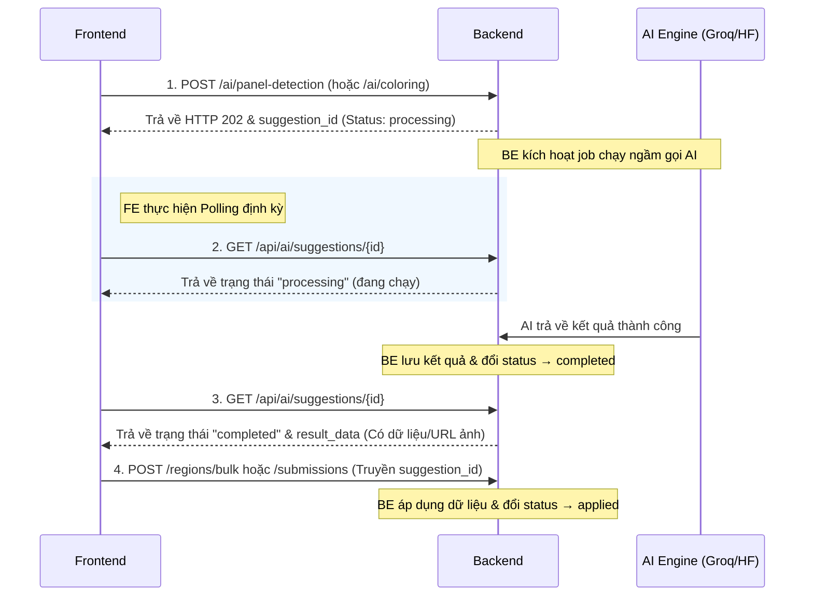
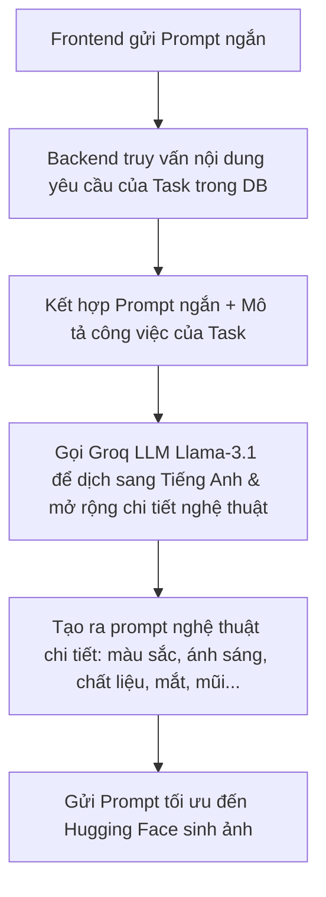

# Hướng dẫn Tích hợp AI Assistant (Frontend)

Tài liệu này hướng dẫn chi tiết cách lập trình viên Frontend tích hợp các tính năng AI Assistant của Backend vào giao diện người dùng.

---

## 💡 Nguyên lý hoạt động chung của AI

Tất cả các tác vụ xử lý ảnh bằng AI (như Nhận diện khung tranh hay Tô màu) thường mất từ **5 đến 30 giây** để hoàn thành. Để tránh tình trạng HTTP Request bị quá hạn (Timeout) và mang lại trải nghiệm mượt mà, Backend thiết kế theo mô hình **Bất đồng bộ (Asynchronous Background Job)**:



---

## 🎨 Luồng 1: Nhận diện khung tranh (Panel Detection)

Dành cho **Mangaka** và **Editor** khi tải lên bản vẽ thô (draft) của trang truyện và muốn tự động cắt nhỏ các khung tranh (panels).

### Bước 1: Khởi tạo tác vụ nhận diện
Frontend gửi một request kích hoạt tiến trình chạy ngầm.

* **API Endpoint**: `POST /api/pages/:pageId/ai/panel-detection`
* **Headers**: `Authorization: Bearer <token>`
* **Params**: `pageId` (UUID của Page cần phân tích)
* **Request Body (Không bắt buộc)**:
  ```json
  {
    "prompt": "Detect all reading panels in this manga page",
    "ai_model": "llama-3.2-11b-vision-preview"
  }
  ```
* **Response (HTTP 202 Accepted)**:
  ```json
  {
    "success": true,
    "message": "AI panel detection job initiated",
    "data": {
      "suggestion_id": "9b1deb4d-3b7d-4bad-9bdd-2b0d7b3dcb6d",
      "page_id": "11111111-1111-4111-a111-111111111111",
      "status": "processing",
      "attempt_number": 1,
      "ai_model": "llama-3.2-11b-vision-preview",
      "prompt": "Detect all reading panels in this manga page",
      "reference_image_url": "https://res.cloudinary.com/.../page.png",
      "result_data": null
    }
  }
  ```

---

### Bước 2: Polling lấy kết quả (Exponential Backoff)
Sau khi nhận được `suggestion_id`, Frontend chạy một bộ hẹn giờ để thăm dò (poll) trạng thái của suggestion.

> [!IMPORTANT]
> **Chiến lược Exponential Backoff bắt buộc:**
> Để tránh làm quá tải máy chủ Backend khi có nhiều người dùng chạy AI cùng lúc, Frontend **không được** gọi polling cố định mỗi giây một lần. Nên tăng dần thời gian chờ giữa các lần gọi:
> * **Lần 1**: Đợi 2 giây mới gọi.
> * **Lần 2**: Đợi tiếp 4 giây.
> * **Lần 3**: Đợi tiếp 8 giây.
> * **Lần 4 trở đi**: Đợi 10 giây mỗi lần.
> * **Timeout**: Nếu sau 60 giây vẫn ở trạng thái `processing`, dừng polling và hiển thị thông báo "AI processing timeout".

* **API Endpoint**: `GET /api/ai/suggestions/:suggestionId`
* **Headers**: `Authorization: Bearer <token>`
* **Response các trường hợp**:

#### Trường hợp A: AI vẫn đang xử lý (`status` = `processing`)
```json
{
  "success": true,
  "message": "Success",
  "data": {
    "suggestion_id": "9b1deb4d-3b7d-4bad-9bdd-2b0d7b3dcb6d",
    "status": "processing",
    "result_data": null
  }
}
```
👉 *Frontend tiếp tục hiển thị hiệu ứng Loading và tiếp tục Polling.*

#### Trường hợp B: AI thành công (`status` = `completed`)
```json
{
  "success": true,
  "message": "Success",
  "data": {
    "suggestion_id": "9b1deb4d-3b7d-4bad-9bdd-2b0d7b3dcb6d",
    "status": "completed",
    "result_data": {
      "panels": [
        { "x": 50, "y": 50, "width": 400, "height": 300 },
        { "x": 480, "y": 50, "width": 470, "height": 300 }
      ]
    },
    "processing_time_ms": 5400
  }
}
```
👉 *Frontend dừng polling, vẽ các khung tọa độ (bounding boxes) lên giao diện thiết kế để người dùng xem trước (Preview) và chỉnh sửa.*

#### Trường hợp C: AI thất bại (`status` = `failed`)
```json
{
  "success": true,
  "message": "Success",
  "data": {
    "suggestion_id": "9b1deb4d-3b7d-4bad-9bdd-2b0d7b3dcb6d",
    "status": "failed",
    "result_data": {
      "error": "Groq AI Panel Detection failed: API returned status 503 Service Unavailable"
    }
  }
}
```
👉 *Frontend dừng polling và hiển thị thông báo lỗi cho người dùng.*

---

### Bước 3: Áp dụng hoặc Từ chối kết quả

#### Hành động 1: Áp dụng (User bấm Lưu các phân vùng đã nhận diện)
Khi người dùng xác nhận các tọa độ phân vùng chính xác (sau khi tự căn chỉnh lại nếu cần), Frontend gửi yêu cầu lưu phân vùng lên bảng chính đồng thời gửi kèm `suggestion_id` để đánh dấu đã áp dụng.

* **API Endpoint**: `POST /api/pages/:pageId/regions/bulk`
* **Headers**: `Authorization: Bearer <token>`
* **Request Body**:
  ```json
  {
    "suggestion_id": "9b1deb4d-3b7d-4bad-9bdd-2b0d7b3dcb6d",
    "regions": [
      { "x": 50, "y": 50, "width": 400, "height": 300, "label": "Panel 1" },
      { "x": 480, "y": 50, "width": 470, "height": 300, "label": "Panel 2" }
    ]
  }
  ```

#### Hành động 2: Từ chối (User bấm Bỏ qua hoặc Hủy luồng)
Nếu người dùng thấy kết quả quá tệ hoặc chủ động bấm nút "Hủy", Frontend cần báo cho Backend biết để chuyển status về `rejected`.

* **API Endpoint**: `PATCH /api/ai/suggestions/:suggestionId/reject`
* **Headers**: `Authorization: Bearer <token>`
* **Response**: Trả về thông tin suggestion với `status` = `"rejected"`.

---

## 🖌️ Luồng 2: Đổ màu thông minh (Smart Coloring)

Dành cho **Assistant**, **Mangaka**, hoặc **Admin** muốn sử dụng AI để tô màu tự động cho các phân vùng phân công công việc.

### Bước 1: Khởi tạo tác vụ đổ màu
* **API Endpoint**: `POST /api/page-tasks/:taskId/ai/coloring`
* **Headers**: `Authorization: Bearer <token>`
* **Params**: `taskId` (UUID của page task cần tô màu)
* **Request Body (Không bắt buộc)**:
  ```json
  {
    "prompt": "vibrant anime colors, soft sunset lighting, studio ghibli style",
    "reference_image_url": "https://res.cloudinary.com/.../ref.png"
  }
  ```
  *(Nếu không gửi `reference_image_url`, Backend sẽ tự động lấy ảnh phiên bản mới nhất của trang truyện đó làm ảnh nguồn).*
* **Response (HTTP 202 Accepted)**: Trả về đối tượng chứa `suggestion_id` và status: `"processing"`.

---

### Bước 2: Polling lấy kết quả
Áp dụng cơ chế **Exponential Backoff** tương tự như phần nhận diện khung tranh.

* **API Endpoint**: `GET /api/ai/suggestions/:suggestionId`
* **Headers**: `Authorization: Bearer <token>`
* **Response trường hợp thành công (`status` = `completed`)**:
  ```json
  {
    "success": true,
    "message": "Success",
    "data": {
      "suggestion_id": "8a7c2e3f-6d1a-4d2b-9e4c-1f8a7c2e3f6d",
      "status": "completed",
      "result_data": {
        "type": "smart_coloring",
        "image_url": "https://res.cloudinary.com/demo/image/upload/v12345/manga-ai-suggestions/colored_image.png",
        "public_id": "manga-ai-suggestions/colored_image"
      },
      "processing_time_ms": 12500
    }
  }
  ```
👉 *Frontend dừng polling và hiển thị hình ảnh từ trường `image_url` lên khung Preview của giao diện.*

---

### Bước 3: Nộp bài hoặc Từ chối kết quả

#### Hành động 1: Nộp bài bằng ảnh AI (Bấm "Sử dụng ảnh AI để nộp")
Assistant (hoặc người thực hiện) đồng ý sử dụng ảnh AI để làm bài nộp cho Task. Frontend gửi API submit task, kèm theo URL ảnh màu và `suggestion_id` để cập nhật trạng thái đồng bộ ở DB.

* **API Endpoint**: `POST /api/page-tasks/:taskId/submissions`
  *(Hoặc endpoint thay thế: `POST /api/assistant/page-tasks/:taskId/submissions`)*
* **Headers**: `Authorization: Bearer <token>`
* **Request Body**:
  ```json
  {
    "file_url": "https://res.cloudinary.com/demo/image/upload/v12345/manga-ai-suggestions/colored_image.png",
    "submission_notes": "Tô màu thông minh bằng AI Assistant",
    "suggestion_id": "8a7c2e3f-6d1a-4d2b-9e4c-1f8a7c2e3f6d"
  }
  ```
👉 *Backend sẽ tạo ra bản ghi `page_submission` mới, tạo phiên bản ảnh màu mới và cập nhật trạng thái gợi ý AI sang `"applied"`.*

#### Hành động 2: Từ chối kết quả
Nếu người dùng không hài lòng hoặc muốn tô màu lại, Frontend gọi API từ chối để dọn dẹp dữ liệu.

* **API Endpoint**: `PATCH /api/ai/suggestions/:suggestionId/reject`
* **Headers**: `Authorization: Bearer <token>`
👉 *Backend sẽ chuyển đổi trạng thái của gợi ý AI sang `"rejected"`. Một Cronjob chạy ngầm hàng tuần ở Backend sẽ tự động quét các bản ghi `rejected` và xóa vĩnh viễn các ảnh rác tương ứng trên Cloudinary để tiết kiệm tài nguyên lưu trữ.*

---

## 💡 Cẩm nang Tối ưu hóa Prompt cho AI (Prompt Engineering & Auto-Enrichment)

Mô hình AI mặc định hiện tại là **FLUX.1-schnell** (mô hình Text-to-Image thế hệ mới). Để mang lại kết quả tô màu/vẽ tối ưu nhất mà không yêu cầu người dùng phải gõ các câu lệnh tiếng Anh phức tạp, Backend đã tích hợp cơ chế **Tự động tối ưu hóa Prompt thông qua Groq LLM**.

### 1. Cơ chế Tự động tối ưu hóa (Auto-Enrichment) ở Backend

Khi Frontend gửi yêu cầu tô màu với một prompt ngắn (ví dụ: `"tô màu rực rỡ"` hoặc thậm chí để trống), Backend sẽ tự động thực hiện các bước sau:



* **Ví dụ thực tế**:
  * **Yêu cầu của Task trong DB**: `"Yêu cầu tại [Vùng 1]: sửa mắt, Yêu cầu tại [Vùng 2]: sửa mũi"`
  * **Prompt người dùng nhập**: `"tô màu rực rỡ"`
  * **Prompt sau khi được Groq tối ưu hóa tự động (gửi cho AI vẽ)**:
    > *"Color a vibrant and dynamic manga/comic page with a bold, eye-catching color palette... Specifically, in region [Vùng 1], create a stunning and detailed eye area with a deep, rich color that seems to shine with an inner light... In region [Vùng 2], craft a beautifully detailed nose area using a delicate blend of shading and texture..."*

---

### 2. Mẹo viết Prompt cho người dùng (Dành cho Giao diện Frontend)

Mặc dù hệ thống tự động tối ưu hóa, kết quả sẽ xuất sắc nhất khi người dùng cung cấp các từ khóa định hướng phong cách. Gợi ý công thức viết prompt nhanh cho Frontend:

> **`[Màu sắc chủ đạo]` + `[Phong cách nghệ thuật]` + `[Ánh sáng/Bối cảnh]`**

#### Bộ từ khóa gợi ý (Prompt Cheat Sheet):

| Loại từ khóa | Từ khóa gợi ý (Tiếng Việt) | Tiếng Anh tương ứng (AI nhận diện tốt nhất) |
| :--- | :--- | :--- |
| **Màu sắc** | Màu rực rỡ, màu neon, màu pastel mềm mại, tông màu ấm, tông màu lạnh | `vibrant colors`, `neon palette`, `soft pastel colors`, `warm tones`, `cool tones` |
| **Phong cách** | Phong cách Anime, nét vẽ Studio Ghibli, màu nước cổ điển, tranh kỹ thuật số | `anime style`, `Studio Ghibli style`, `classic watercolor`, `professional digital painting` |
| **Ánh sáng** | Ánh sáng hoàng hôn, ánh sáng dịu, tương phản cao, đổ bóng cel-shading | `sunset lighting`, `soft ambient light`, `high contrast`, `cel shading` |

#### Ví dụ Prompt tối ưu nên khuyên người dùng nhập:
* **Tô màu nhân vật**: `"anime style, vibrant colors, sunset warm light, clean cel shading"`
* **Tô màu phong cảnh**: `"watercolor style, pastel colors, soft daylight, high detailed environment"`

---

### 3. Thông tin về các mô hình AI (AI Models)

Frontend có thể cung cấp lựa chọn mô hình cho người dùng qua ô cấu hình:

1. **`black-forest-labs/FLUX.1-schnell` (Mặc định)**:
   * **Thể loại**: Text-to-Image.
   * **Ưu điểm**: Xử lý cực nhanh (chỉ từ 2 - 5 giây), chi tiết vẽ sắc nét, chất lượng nhân vật anime/manga cực đỉnh.
   * **Lưu ý**: Chỉ nhận diện văn bản (prompt), không nhận ảnh gốc đầu vào.
2. **`stabilityai/stable-diffusion-xl-base-1.0` (Hoặc các bản tùy biến)**:
   * **Thể loại**: Image-to-Image.
   * **Ưu điểm**: Có thể đọc cấu trúc nét vẽ từ hình ảnh gốc của trang truyện để đắp màu đè lên.
   * **Lưu ý**: Thời gian xử lý lâu hơn (khoảng 15 - 25 giây).

